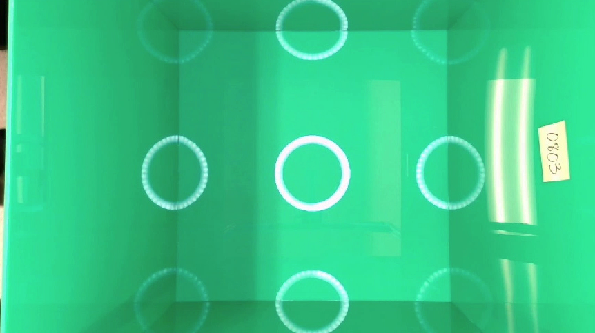
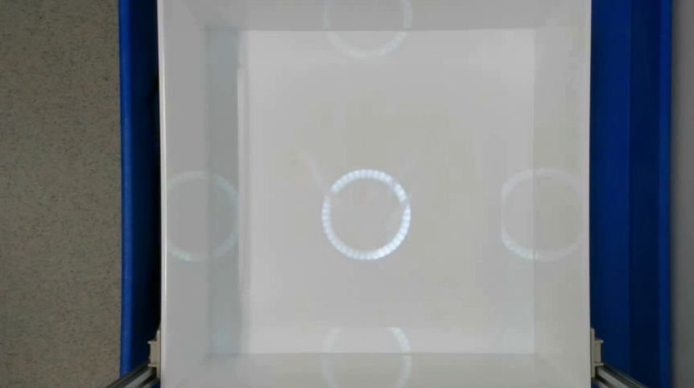
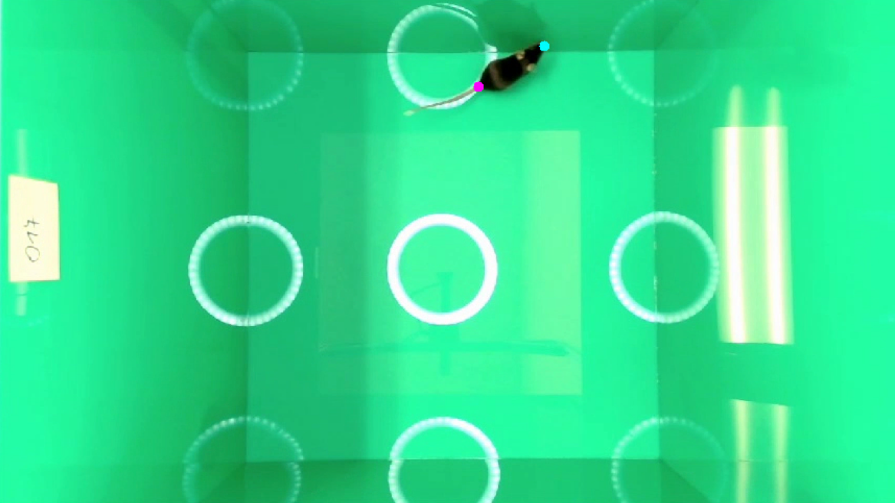
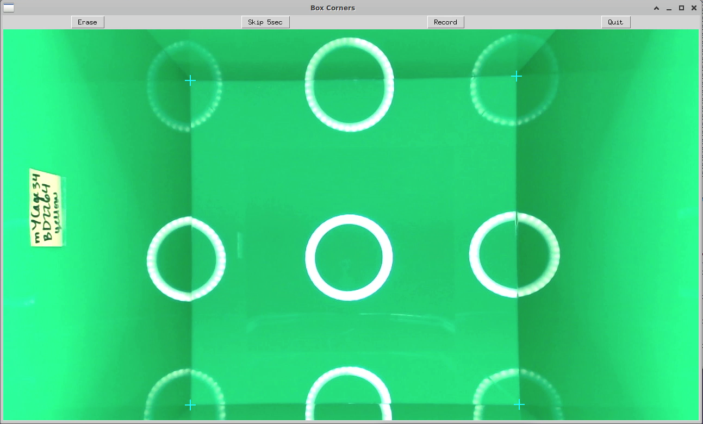
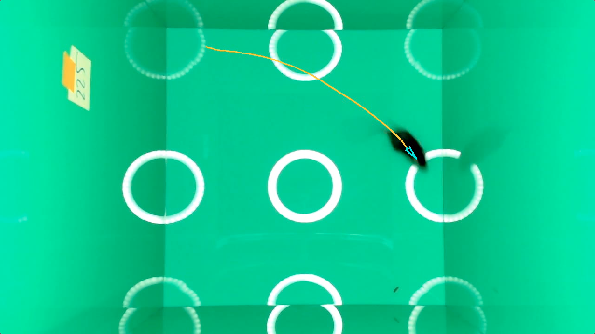

    
    

[Back to home.](../README.md)

# Description of Analytical Methods
This section provides a description of the analytical pipeline implemented by this system.

Overview: this system uses an ML image classification model to detect when the mouse is placed in the box and
label that time point as "time zero".  Following that, ML object detection and keypoint models are used to 
determine the position and front/back orientation of the mouse in each frame.  
Finally, the position and orientation information are used to calculate behavioral metrics.
Some of these analyses require accurate image scaling and accurate placement of the mouse within the
confines of the open field.  Reference points (bottom box corners) are marked by the researcher, for each video, 
using the provided GUI script.

## Mouse Placement / Hand Detection (Time Zero)

Open field assays, including this one, measure mouse activity and behavior across some interval of time, starting
when the mouse is placed in the open field box (by default, our system analyzes 10 minutes).  This system assumes
that video recording begins before the mouse is placed in the box, and "time zero" is identified using an ML model
that identifies when a scientist's hand reaches into the box to place the mouse.  It is assumed this only occurs once
across the span of the video.

The ML model used for this task is an image classification model, trained to classify frames of video into one
of three classes: <b>hand</b> (when a scientist's hand can be seen in frame), <b>mouse</b> (when a mouse is in the box
but there is no hand visible), and <b>none</b> (when the box is empty, prior to introduction of the mouse).  Randomly
selected frames from the first minute of each of a series of test videos were manually classified into one of those three
categories.  These frames were selected from hundreds of videos, collected as part of five different <i>in vivo</i>
studies.  In preparation for training, scientists conducting the studies were asked to change gloves and lab coats to
different-color options as much as possible.  Most of these studies used 
<a href="https://www.jax.org/news-and-insights/jax-blog/2020/august/jax-diversity-outbred-mice-a-genetically-diverse-mouse-for-a-diverse-human">JAX Diversity Outbred</a>
mice, which include a variety of body sizes and three coat colors: black, white, and agouti.  Some studies used inbred mouse 
strains with a variety of coat colors.  Approximately half of the videos & images were collected from videos taken in white 
boxes (see examples below).

A total of 10,541 images were sorted.  They were classified as: 305 for <b>hand</b>, 5,523 for 
<b>none</b>, and 4,713 for <b>mouse</b>.  For the test set, images were randomly selected from each category to slightly even the ratios and create an
enrichment for mouse-containing images (expected to be the majority of frames in videos from experiments): 47 for <b>hand</b>, 
95 for <b>none</b>, and 208 for <b>mouse</b>.  For the training set, all remaining images were used, and similar balance was
achived during image augmentation.

For augmentation, all images were flipped horizontally, then all images (including horizontally-flipped images) were flipped 
vertically.  That set of images was then amplified using random alterations to zoom (allowing up to 5% of image edges to be 
trimmed), hue (i.e. brightness, applied separately to each color channel), and contrast.  Those same random augmentations
were also applied to color-negative versions of the images, as well as images in which color-negative was applied separately to
each of the three RGB color channels.  The aim was to create a set of images through augmentation that would preemptively
prepare the model for unanticipated changes in glove and lab coat colors (for the scientists), coat colors (for the mice),
and lighting conditions & color fading (for the boxes).  Note that the model performance was only evaluated against green boxes 
(the intended use) and white boxes.  Through those augmentations, a training set was produced with class ratios similar to
the test set: 6,192 for <b>hand</b>, 7,200 for <b>none</b>, and 12,000 for <b>mouse</b>.

Training was performed using transfer learning on the <a href="https://www.kaggle.com/models/google/efficientnet/tensorFlow1/b0-classification/">Google 
efficientnet B0 model</a>. Evaluated using the test set described above, the Cohen's kappa value for the final model was 0.954 with the 
following confusion matrix (rows=human, cols=model):

|      | hand  | none | mouse | total |
| ---- | ----:| ---:| ---:| -----:|
| **hand** | 43 | 1 | 3 | 47 |
| **none** | 0 | 95 | 0 | 95 |
| **mouse** | 3 | 2 | 203 | 208 |
| **total** | 46 | 98 | 206 | |

**Cohen's kappa (test set) = 0.954**

Three alternative methods for selecting the "time zero" frame are provided, selectable using the `--begin_type` flag.
Inputting `best` will select the frame with the highest confidence score returned by the ML model for <b>hand</b> as
frame zero.  Inputting `last` will select the latest-time frame whose top-scoring class is <b>hand</b>.  Inputting
`hmm` will apply a Hidden Markov Model to select time zero.  The applied model has three states, corresponding to
the three classes (<b>hand</b>, <b>none</b>, and <b>mouse</b>).  Initial probabilities are set to: 0.05 for <b>hand</b>,
0.25 for <b>none</b>, and 0.7 for <b>mouse</b>.  Transition probabilities are calculated based on those initial
probabilities and an expected dwell time of 15 frames.  Transitions to the same state are all set to 14/15; transitions
between states are set to <i>pi</i> / (15 * <i>po</i>), where <i>pi</i> is the initial
probability for the new state and <i>po</i> is the sum of initial probabilities for all states except the
current state.  This HMM is parsed across all frames using the Viterbi algorithm, taking the probabilities assigned to
each state at each frame by the ML model as the emission probabilities. From that parse, the time-zero frame is
selected as the frame after the last frame parsed as <b>hand</b>.

For whichever method was selected: time zero is defined at the video frame one second after the frame determined
using the methods above, providing a short buffer to account for the researcher removing their hands
from the box (the exact number of frames depends on the frame rate of the video).

## Mouse Identification & Orientation

Mouse behavior is analyzed in terms of the mouse's movement and orientation, determined through the detection of
two keypoints: <b>nose</b> and <b>tail</b>.  These keypoints are identified through a two-step pipeline, involving
two ML models.  First, an object detection model is used to find the mouse in the video.  Second, the box drawn around
the mouse is extracted from the larger image, and that zoomed-in image is analyzed by a segmentation model, whose
output is used to calculate the keypoint positions.

### Object detection

An object detection model was trained to detect a mouse in the open field environment through transfer learning,
applied to the 
<a href="https://www.kaggle.com/models/tensorflow/ssd-mobilenet-v1/">ssd_mobilenet_v1 model</a>, which had been
trained on the COCO data set.

Training and test data were annotated by manually drawing boxes around mice in both white and green open field boxes
(see sample images above, under "Hand detection").   in each environment;
white mice against white backgrounds were not included due to low contrast.  For green boxes, inbred mice with white or 
black coats were filmed, and 1,000 frame images were randomly
selected from 14 videos for annotation, 963 of which contained mice and so could be used.  Those were randomly split into training
(672 images) and test (291 images) sets.  For white boxes, 
<a href="https://www.jax.org/news-and-insights/jax-blog/2020/august/jax-diversity-outbred-mice-a-genetically-diverse-mouse-for-a-diverse-human">JAX Diversity Outbred</a>
mice were filmed, and 600 images were annotated from 128 source videos,  575 of which contained mice and so could be used.  
Those were randomly split into training (401 images) and test (174 images) sets.

The training set was expanded using image augmentation.  As with hand detection, there was an emphasis on making
the detector model robust against changes in mouse coat color.  Augmentations applied to both the white-box anbd
green-box images included: all possible 90-degree image rotations, with and without mirror imaging; random zoom 
(allowing up to 5% of image edges to be trimmed); random ajustment of birghtness, contrast, or hue (i.e. brightness, applied separately to 
each color channel); and color-negative versions of the images.  For the green-box images, color rotation (i.e. random swapping of the RGB 
color layers) was also applied.  Rotation & zoom augmentations were applied together with color-based augmentations;
color-based augmentations were applied separately from one another.  Combined with the input images, these augmentations
created a training set of 15,003 images.

The object detection model is applied to each image, and the top-scoring box used for downstream analysis, irrespective of the
score given.  Under this regime, the intersection-over-union (IoU) score for this model in the context of green boxes from the test
set described above (the true use case) was <b>0.835</b>, while the IoU score for DO mice in white boxes was <b>0.870</b>.

### Keypoint detection

Keypoints for the <b>nose</b> and <b>tail</b> of the mouse were detected using an image segmentation model.  This model
was trained on segmentation data in which two layers were labelled (<b>nose</b> and <b>tail</b>), each annotated as a circle
10 pixels in diameter, centered at the intended position of the keypoint.  <b>Tail</b> keypoints were marked at the base of the 
tail.  Training & testing images were were 486 by 864 pixels, so this example illustrates the scale of the keypoint dots (<b>nose</b>
in cyan; <b>tail</b> in pink):

The same green and white boxes were annotated for nose & tail positions as had been used for training & testing of the <b>object
detection</b> model, described above.  The same images were assigned to the training and test sets as for that model.  For training
and testing, zoomed-in images were extracted from the full-scale images based on the boxes drawn for training the object detector model, 
expanded to 120% the original size (i.e. along each dimension, 10% the length was added to each side of the box).  For the training set,
the same rotation/reflection and color-based augmentations were applied.  In addition, the positions and shapes of extracted mouse images
were randomized, modified by up to 20% of each axis length.  Zoomed mouse images were also randomly tilted by up to 20 degrees, to either 
the left or right.  The fully-augmented training set included 17,168 total images.

The segmentation model was trained using the <a href="https://github.com/divamgupta/image-segmentation-keras">“image-segmentation-keras” code base</a>
(commit f04852d from September 6, 2019), specifying the “vgg_unet” architecture, with input height & width both set to 64.  The performance of
the final model was low in terms of IoU (0.526 and 0.536 for the green-box and white-box test sets, respectively).  In the application, keypoints
are selected from masks by taking the median x-axis coordinate and median y-axis coordinate for all pixels annotated for each label.  The distances
between hand-annotated keypoints (i.e. center points of the dots) and the ML-mask-derived keypoints were <b>2.92 pixels</b> (SD 5.57 pixels) for the green-box 
test set and <b>2.77 pixels</b> (SD 4.79 pixels) for the white-box test set.  In both cases, this placed the predicted keypoints generally within the
dot that had been manually annotated.

### Application of model outputs to analysis

For each video frame, the <b>mouse detector</b> model is applied, and the highest-scoring box is used to extract a zoomed-in image of the mouse,
adding 20% to the box dimensions.  The <b>keypoint segmentation</b> model is applied to that image, and the median coordinates of all labelled
pixels for each of the <b>nose</b> and <b>tail</b> masks taken as the keypoints.  Those keypoint's positions are then converted back to the full
image coordinate system.  The <b>position</b> of the mouse is taken as the mean position of those two keypoints, and the <b>orientation</b> is taken
as the vector direction from the tail keypoint to the nose keypoint.

Before being used for downstream analyses, both the <b>orientation angle</b> and <b>position</b> values are smoothed by averaging
across a window of 15 frames (the index frame, plus the seven before and seven after).  The kernel size 
of 15 frames is used regardless of video frame rate.  For the angle, the circular average is taken using
<a href="https://docs.scipy.org/doc/scipy/reference/generated/scipy.stats.circmean.html">this function</a>.

## Box Corner Marking

For each video, the positions of the corners of the floor of the open field box are marked using the provided script `markFieldBoxCorners.py`:

These corner markings provide scale and positional information for downstream analyses, given the known box dimensions as
specified in [Building the Box](BoxConstruction.md).  The conversion factor from pixel-length displacement to centimeters is
calculated using the average lengths of the four lines connecting the four annotated points.  Neither camera angle nor fisheye
effects are modelled.  For considering the distance of the mouse from the box edge, that is again performed using the perpendicular
distance to the closest of the four edge lines, according to the coordinates in the image, without modelling lens or 3D effects.

See [Installing & Using the Software](docs/UserGuide.md) for more details on the annotation tool.

## Metric Measurement
All metrics are measured using the continuous stream of data, starting from the frame at "time zero", determined as described above.
All coordinates and angles are smoothed across 15 frames, as described above, before being
used for computation of the metrics below.

### Metric: Total Distance
Differences in position are calculated across half-second intervals, across the analysis time, and summed.  Pixel distances
are calculated then converted to meters using the corner annoations and known box dimensions.

### Metric: Rotation
Minimum differences in orientation direction are calculated across half-second intervals, across the analysis time, and summed.
Results are reported in radians.

### Metric: Distance Per Rotation
<b>Total Distance</b> (above) is divided by <b>Rotation</b> (above).  Units are meter/radian.

### Metric: Gait Speed
Average speed across the analysis period, but averaged over distance rather than time.  This measures how fast the mouse
is moving <i>when it is moving</i>.  This is achieved by computing a
weighted average of the speeds measured across each half-second interval, as collected for <b>Total Distance</b>.
Speeds are the distances travelled in each half-second interval divided by the half-second time; weights are those same
distances travelled.

### Metric: Middle-of-Box Exploration
The fraction of time that the mouse spends exploring the "middle" of the box, versus near the "edges" of the box.  This
is a behavioral trait often attributed to exploratory impulse.  At each frame, the closest distance of the mouse's position
point (the halfway point between nose and tail keypoints) to one of the four edges
is measured, with each edge defined by the line defined through annotation of that edge's two corner points.
The threshold between "middle" and "edge" is set to <b>0.074 meters</b>.  That value was derived empirically: in a set of videos
in which the mice spent most of the time walking around the edges of the box, the mean (0.037 meters, SD 0.009) and 
median (0.035 meters) distances from the wall were calculated and were very close.  The threshold was set to twice the mean distance, to allow for
wobble and varied girth.

## Vizualization of Analytics

The script `viewOpenFieldResults.py` can be used to generate a movie showing the position, orientation, and traced walking paths
of the mice overlaid onto the video.  A cyan arrow draws the orientation direction in each frame (after 15-frame smoothing), and a
cyan dot indicates the position in that frame.  An orange tail will trail behind the green dot across its path spanning a user-specified
length of time, illustrating the trace of the mouse's movement.  The resulting video will resemble the screen cap below:

In addition to providing clarifying videos for presentations, this tool is useful for troubleshooting model failure: for instance, if
you inadvertently introduced a visual artifact, you can use this video to assess if, when, and how the artifact might have affected the ML
model's ability to track the mouse.  Colors and track lengths are user-modifiable.
