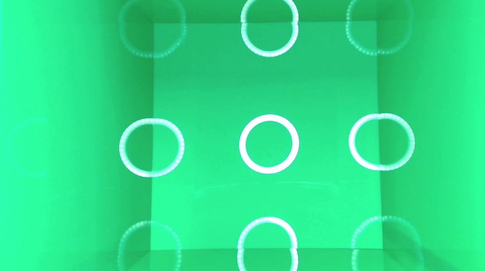
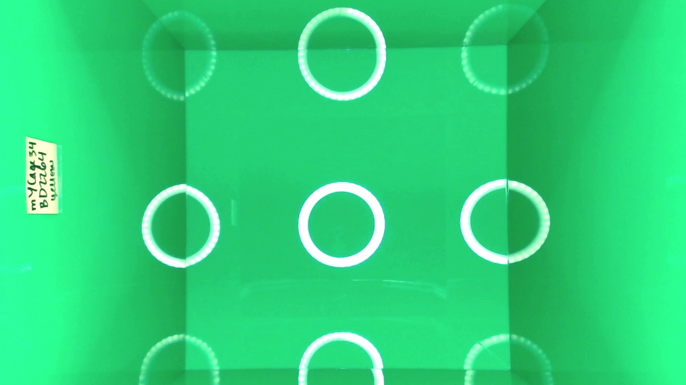
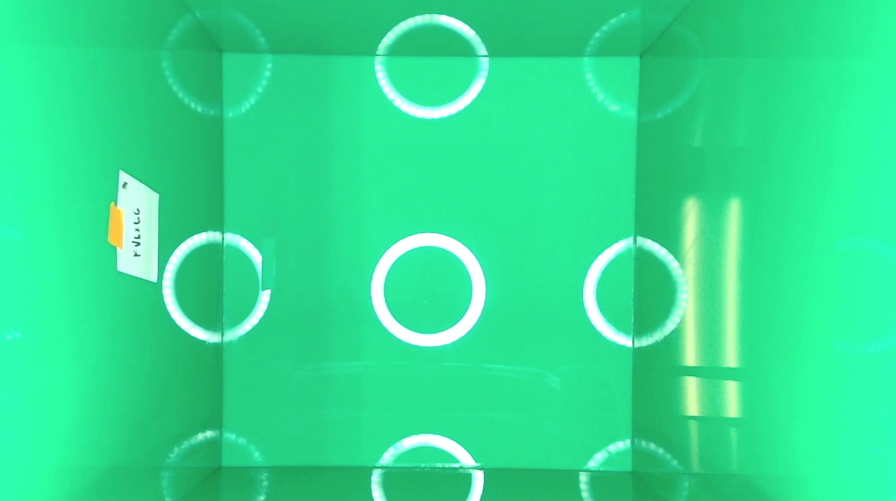
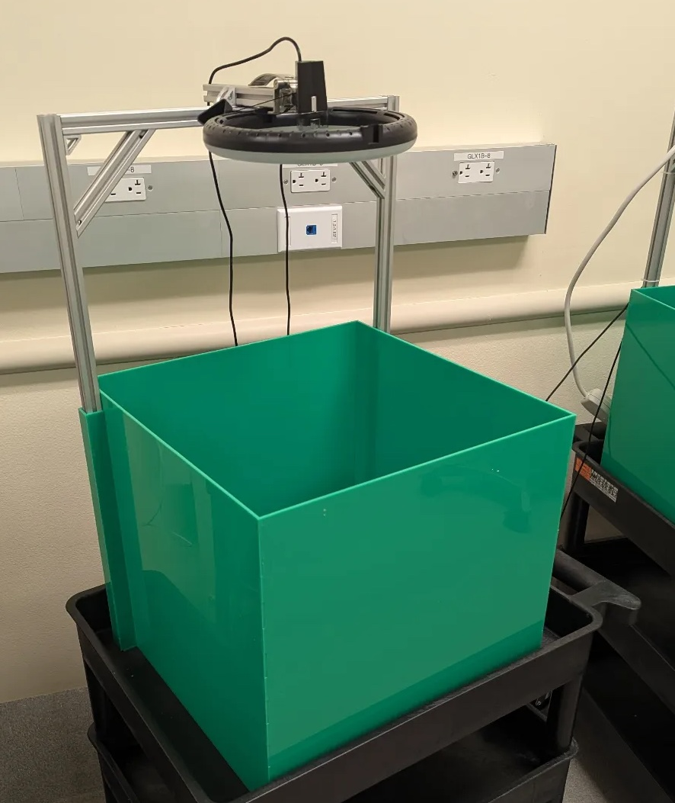

    
    

[Back to home.](../README.md)

# Open Field Box Construction
This section provides instructions for the assembly of an open-field box that will be compatible with the ML models & analytics system 
provided here. Some adjustments may be tolerated, and some aspects of this system may be under-specified. Please use the sample images 
below as guides as you set up your system: your video footage should look very, very similar.

Here is a side view of the fully-assembled system:

The box itself is made out of 3mm thick sheets of
[Chemcast Translucent & Opaque Colored Cast Acrylic, Kelly Green, 9%](https://www.tapplastics.com/product/plastics/cut_to_size_plastic/acrylic_sheets_color/341).
Plastic components were cut using a laser cutter, using the linked PDF documents for the 
[base](BoxParts/openfieldbox_base_green_cymk.pdf) (one per box), [side 1](BoxParts/openfieldbox_side1_green_cymk_H400mm.pdf) (two per box), [side 2](BoxParts/openfieldbox_side2_cymk_green_H400mm.pdf) (two per box), and [camera mount slot components](BoxParts/openfieldbox_cymk_green_camera_arm_holder.pdf).
They were assembled and adhered together using [non-whitening acrylic cement](https://www.mcmaster.com/7517A104/?publication=ecmrc&pnchstp=2&combine_content=true).
Apply sparingly to avoid droplets from oozing when the pieces are pushed together.

<i>add note about framing</i>

The camera arm is mounted on a frame made out of 
[20 mm t-slotted framing rails and connectors](https://www.mcmaster.com/products/t-slotted-framing/rail-height~20-mm/t-slotted-framing-rails-4/).
We chose the height of the camera arm to give a good view of the box (28’’ with our camera; should approximately
match the sample images above).  This can also be adjusted with the camera's zoom setting (depending on the camera).

We are using a generic [webcam](https://www.cdw.com/product/aluratek-awc01f-webcam/6040462) and [ring light](https://www.newegg.com/p/0TU-003F-00007). 

## A Note About Recording Software
For the video recording, any app or software that allows recording from the webcams and saving of the file will do. 
We have used QuickTime to record on MacBook hardware.  Multiple streams (coming from multiple boxes) can be recorded
simultaneously with multiple instances of QuickTime running in parallel, depending on the MacBook's performance.  We've
had success with up to five parallel recordings.  You should test your system ahead of running an experiment with mice,
and monitor system resource use.  In our experience, RAM tends to be the limiting computational resource.

## A Note About Cleaning
Boxes are cleaned in between runs.  We first use a wet paper towel to remove excrement, then use 
[this](https://www.coneinstruments.com/product/Protex-One-Step-Disinfectant-Spray-CI?option=911449)
quaternary ammonia based disinfectant, spraying all inner surfaces thoroughly.  We let the disinfectant
sit for one minute, then wipe all surfaces dry with clean paper towels.  

We have found the boxes to be robust against this cleaning procedure across extended use periods.  However,
some erosion to the adhesive may take place: this should be regularly monitored and either repaired with more
adhesive or the box replaced entirely.

