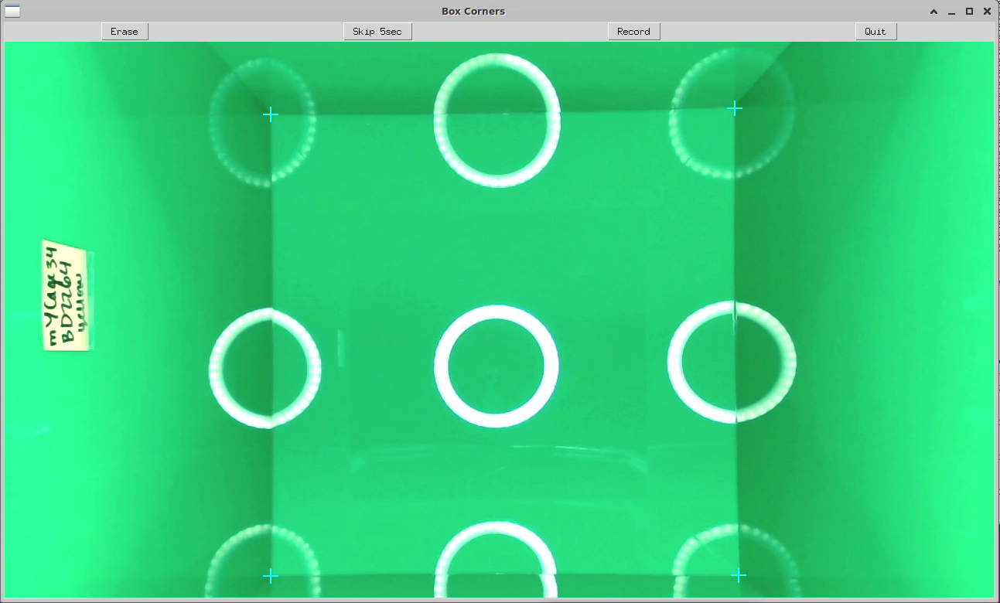

<p>
    <a href="https://docs.calicolabs.com/python-template"></a>
    <a href="https://github.com/psf/black"></a>
</p>

[Back to home.](../README.md)

# Software User Guide
For a walk-through example of how to use this software, see the [example run-through](docs/exampleRunThrough.md) document.

## Installation
The recommended build environment for the code is to have [Anaconda](https://docs.anaconda.com/anaconda/install/) installed and then to create a conda environment for python 3 as shown below:

```
conda create -n opfield python=3.7
```

Once created, activate the environment and install all the needed libraries as follows: 

``` 
conda activate opfield
pip install -r requirements.txt
```

This software also depends on <b>Tkinter</b>, which should be included in your python installation.

## Overview

For each video file, three tasks must be run (in any order).  Two are scripts that run on their own:
```
openFieldStates.py
openFieldTrace.py
```

One is a script that launches a GUI (see details on use below):
```
markFieldBoxCorners.py
```

Once all three of those have been run, the final script can be run that outputs a statistic for each analyzed parameter from each video:
```
openFieldAnalysis.py
```

If you would like to create a video visualizing the tracing of mouse movement across your source open field video, that can be generated with this script:
```
viewOpenFieldResults.py
```

## Instructions for markFieldBoxCorners.py

This script provides a GUI so that the corners of the base of the open field box can be marked.  The placement of these marks will establish the scale/resolution of the image, given the known centimeter dimensions of the box (see [Building the Box](BoxConstruction.md)).  It will also define the edges of the box for analysis of whether the mouse is staying close to the edge or exploring the center of the box (see [Analytical Methods](Analysis.md)).  The GUI looks like this:



Clicking anywhere on the image will mark that position as one of the corners, and a cyan cross will appear.  The previously annotated point can be undone with the "<b>Erase</b>" button (stack-style).  Corners can be annotated in any order.  The script expects four points to be annotated: if additional points are clicked, they will replace the first points (queue-style).  The input file will list videos that need to be annotated, and it is assumed that the box will not move in the frame throughout the video.  The user will therefore be asked to annotate only the first frame of each video. 
 If, however a corner is obscured in the first frame, then the user can advance to a later frame in the video (five seconds later) using the "<b>Skip 5sec</b>" button.  Once the user is satisfied with their annotations (it should look similar to the example image above), those corner positions for that video can be recorded to the output file using the "<b>Record</b>" button.  The screen will go blank and an exception reported on the command line when all videos have been annotated, and the user can exit using the "<b>Quit</b>" button.

# Args for openFieldStates.py:
```
usage: openFieldStates.py [-h] [-i INPUT_MOV] [-o OUTPUT_FILE]
                          [--max_fr MAX_FR] [--time_file TIME_FILE]

optional arguments:
  -h, --help            show this help message and exit
  -i INPUT_MOV, --input_mov INPUT_MOV
                        the movie to be viewed
  -o OUTPUT_FILE, --output_file OUTPUT_FILE
                        the parsed-state file to be written to (no value =>
                        stdout)
  --max_fr MAX_FR       max num frames to analyze
  --time_file TIME_FILE
                        an output file with data about runtime
```
# Args for openFieldTrace.py:
```
usage: openFieldTrace.py [-h] [-i INPUT_MOV] [-o OUTPUT_FILE]
                         [--max_fr MAX_FR] [--time_file TIME_FILE]

optional arguments:
  -h, --help            show this help message and exit
  -i INPUT_MOV, --input_mov INPUT_MOV
                        the movie to be viewed
  -o OUTPUT_FILE, --output_file OUTPUT_FILE
                        the parsed-state file to be written to (no value =>
                        stdout)
  --max_fr MAX_FR       max num frames to analyze
  --time_file TIME_FILE
                        an output file with data about runtime
```
# Args for markFieldBoxCorners.py:
```
usage: markFieldBoxCorners.py [-h] [-i INPUT_FOF] [-o OUTPUT_FILE]

optional arguments:
  -h, --help            show this help message and exit
  -i INPUT_FOF, --input_fof INPUT_FOF
                        the file-of-movie-files to be annotated
  -o OUTPUT_FILE, --output_file OUTPUT_FILE
                        will re-list the files along with box coords from each
```
# Args for openFieldAnalysis.py:
```
usage: openFieldAnalysis.py [-h] [-t TRACE_DIR] [-s STATE_DIR] [-c CORNER_FILE] [-b BEGIN_TYPE] [--adjust_fps] [--use_video_base] [--time_min TIME_MIN] [--header]

optional arguments:
  -h, --help            show this help message and exit
  -t TRACE_DIR, --trace_dir TRACE_DIR
                        directory with .txt files for trace results
  -s STATE_DIR, --state_dir STATE_DIR
                        directory with .txt files for state results
  -c CORNER_FILE, --corner_file CORNER_FILE
                        a file of corner coordinates (can be used multiple times)
  -b BEGIN_TYPE, --begin_type BEGIN_TYPE
                        how to define the beginning of analysis (hmm or best or last)
  --adjust_fps          do NOT assume 30fps, instead observe & adjust to true fps
  --use_video_base      allow the paths in the state/trace/corner files to differ
  --time_min TIME_MIN   how long to analyze behavior, in minutes (default: 10)
  --header              include a header line in the output
```
# Args for viewOpenFieldResults.py:
```
usage: viewOpFldResults_220717.py [-h] [-t TRACE_FILE] [-s STATE_FILE]
                                  [-o OUTPUT_MOV] [--start_type START_TYPE]
                                  [--avg AVG] [--tail TAIL]
                                  [--line_color LINE_COLOR]
                                  [--dir_color DIR_COLOR]
                                  [--allow_inconsistent]

optional arguments:
  -h, --help            show this help message and exit
  -t TRACE_FILE, --trace_file TRACE_FILE
                        trace file
  -s STATE_FILE, --state_file STATE_FILE
                        state file
  -o OUTPUT_MOV, --output_mov OUTPUT_MOV
                        the ouput movie of mask (or box) images
  --start_type START_TYPE
                        how to define the beginning of analysis (hmm or best)
  --avg AVG             number of frames to average across. odd num;
                        default==1
  --tail TAIL           number of frames to show the position trail;
                        default==0
  --line_color LINE_COLOR
                        set bgr color (comma-separated ints, 0-255)
  --dir_color DIR_COLOR
                        set bgr color (comma-separated ints, 0-255)
  --allow_inconsistent  allow diff source videos```
