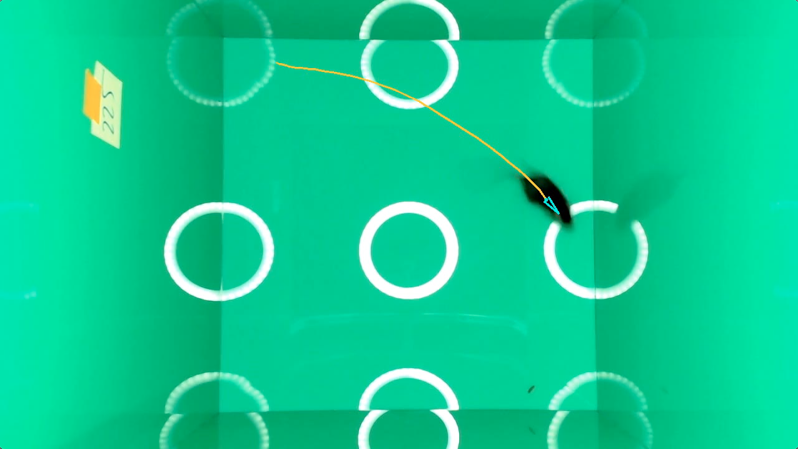

<p>
    <a href="https://docs.calicolabs.com/python-template"></a>
    <a href="https://github.com/psf/black"></a>
</p>

[Back to home.](../README.md)

# Example Run-Through
Try out this provided test case after installing the software, as described in [Installing & Using the Software](docs/UserGuide.md),
where you can also find details on options beyond what is used here.

Final results from this sample are provided in the table at the bottom of this page.  Note that your results should be very
similar but will likely not be exact matches.  This is especially true due to the manual annotation of box corners, which
which are unlikely to exactly match pixel positions between users.  However, these differences should have minimal impact
on the results, limited to the small decimal places.  If you are concerned that your installation is not working properly,
we have also provided each intermediate file, so you can try each step starting with our intermediates that produced the
final result shown below.  Those files have the same names as the files that we recommend creating, but include the word
`SAMPLE` added at the beginning.

All of the commands shown below are executed from the `Scripts` directory of this repo.

## 1) Set up the environment
Create a directory for your analysis files and results.  Include sub-directories for the `state` and `trace` intermediate results:
```
$ mkdir <RESULT_DIR>
$ mkdir <RESULT_DIR>/state
$ mkdir <RESULT_DIR>/trace
```
For running the test example, these directories already exist (`RESULT_DIR` = `../TestSampleData`).

Create a file that lists all of the video files you will be analyzing, one per line:
```
$ ls <VIDEO_DIR>/*.mp4 >> <RESULT_DIR>/vidList.txt
```
For running the test example, there will only be one video file, in the same directory where the analysis will be stored:
```
$ ls ../TestSampleData/*.mp4 >> ../TestSampleData/vidList.txt
```

## 2) Generate the output from ML models (state & trace)
There are two scripts to be run: one analyzes the `state`, i.e. hand detection; the other analyzes `trace`, i.e. finding
the mouse and its keypoints.  See [Analytical Methods](docs/Analysis.md) for details.  In each case, the output file should
have the same name as the input video file, except for the append being `.txt` rather than whatever it is for your video
file format (here, `.mp4`).  Each analysis output file should be placed in its appropriate directory.  Using the provided
`../TestSampleData` directory, and the provided sample video:

<b>State:</b>
```
$ python openFieldStates.py -i ../TestSampleData/sampleVid.mp4 -o ../TestSampleData/state/sampleVid.txt
```

<b>Trace:</b>
```
$ python openFieldTrace.py -i ../TestSampleData/sampleVid.mp4 -o ../TestSampleData/trace/sampleVid.txt
```

## 3) Annotate the box corners
Executing this command will pull up a GUI that you can use to annotate the corners.  Click the four corners at the base of the box,
as illustrated below (cyan crosses).  If you don't like where you clicked for a corner, click the `Erase` button to undo, then
re-annotate that corner.  After you've annotated all four corners (in any order), click `Record`, which will write their positions 
to the output file.  Normally, this will pull up the first frame of the next
video listed in the input file, for annotation.  Here, with one sample file, the screen will go grey, indicating that all of the 
videos' corners have been annotated.  Click on `Quit` to exit.
```
$ python markFieldBoxCorners.py -i ../TestSampleData/vidList.txt -o ../TestSampleData/vidList.corners.txt
```


## 4) Generate the final results
Run this script to generate the numerical measurements for all video files listed in the corner-list file:
```
$ python openFieldAnalysis.py -t ../TestSampleData/trace/ -s ../TestSampleData/state/ -c ../TestSampleData/vidList.corners.txt -b best --adjust_fps --time_min 1 --header
```

The results will print to the command-line as a tab-delimited text file.  You can re-direct this output into a file (`>` or `>>`) 
for long-term storage (not shown).  Here are the results we got: yours should be very similar, but they are unlikely to be an exact match 
unless you use the provided corner file: `../TestSampleData/SAMPLE.vidList.corners.txt`.  Note that the results will print as columns, but
are being shown below as rows:

| Column | Value |
| :----- | :---- |
| **Video** | sampleVid.mp4 |
| **dist(meters)** | 3.1594217097296595 |
| **rot(radians)** | 54.424602801250934 |
| **distPerRot(m/rad)** | 0.05805135080668041 |
| **f(middle)** | 0.011660188784008884 |
| **gspeed(m/sec)** | 0.02866640791768497 |
| **start(frame)** | 199 |
| **start(sec)** | 6.63333333333333 |

## 5) Visualize the mouse movement (optional)
Run this script to generate a movie where the orientation and movement of the mouse, as determined by the ML tracker, are illustrated:
```
$ python viewOpenFieldResults.py -s ../TestSampleData/state/sampleVid.txt -t ../TestSampleData/trace/sampleVid.txt -o ../TestSampleData/sampleVid.annot.avi --start_type best --avg 15 --tail 50
```


By default, the colors of the arrow and trace line are cyan and orange, respectively, but these are user-modifiable.
At the beginning of the video, before and during the placement of the mouse in the box, the border of the video will
be highlighted with a yellow edge:


